# ND025 - Supervised Learning

#### Tags
* Author : AH Uyekita
* Title  :  _Linear Regression_
* Date   : 22/02/2019
* Course : Data Scientist Nanodegree Program
    * COD    : ND025
    * **Instructor:** Luis Serrano

***

## Linear Regression

The two main families of *predictives* machine learning algorithms:

* Classification;
    * Answers question: `Yes` or `No`, Spam/not, Sick/not;
* Regression.
    * Answers question: How much.

This section is all about the **Linear Regression**.

### Line Equation

Recall the line equation in Figure 1.

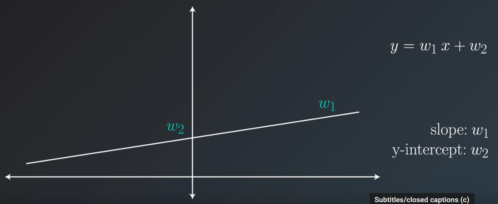

Where:

* $w_1$: slope, and;
* $w_2$: intercept.

$$y = w_1 x + w_2 \tag{1}$$

### Moving the Line

The objective to move a line (changing the slope and intercept) is to fit that line to pass through the "target" point or to be as closer as possible to it.

Increasing $w_1$ (slope) the line will rotate around the $w_2$, and increasing $w_2$ (intercept) the line will be shift keeping the same slope.

There are two "strategies" to performs this line adjutment:

* Absolute Trick, and;
* Square Trick.

The strategy should be used sistematicaly until a certain condition is satisfied and the process ends.

#### Absolute Trick

The easiest way to adjust the line to fit the point is adding or subtracting a constant value of the intercept and slope. For instance, you can add `+1` to the slope and `+1` to the intercept and evaluate if the new line is closer to the point.

$$y = (w_1 + 1) \cdot x + (w_2 + 1) \tag{2}$$

Due to the `+1` is "too much" in term of slope, it is advisable to use a small value, instead of a huge value because you can "pass" the point. The $\alpha$, also called **learning rate**, is used to convert the `+1` in a small value. Assuming $\alpha$ as 0.01.

$$y = (w_1 + 1 \cdot \alpha ) \cdot x + (w_2 + 1 \cdot \alpha ) \tag{3}$$

As you can see, equation (3) will only work if the point to be fitted is above the line. Figure 2 shows it.

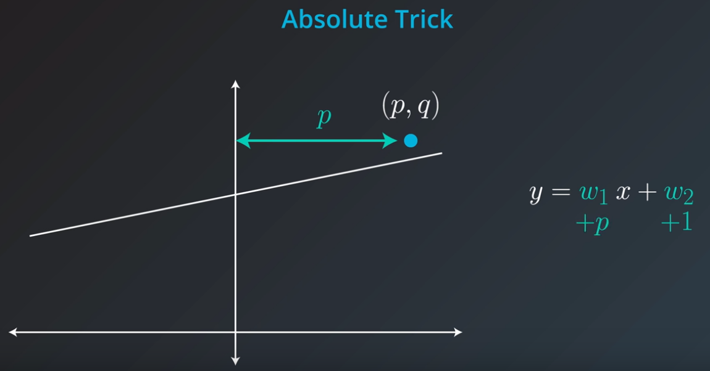

<center><em>Figure 2 - Example of Absolute Trick.</em></center>

We could fix it changing the operation of adding to subtracting.

$$y = (w_1 - 1 \cdot \alpha ) \cdot x + (w_2 - 1 \cdot \alpha ) \tag{4}$$

Unfortunately, equation (4) will not work if the point is in the second or third quadrants. Figure 3 shows an example of it.

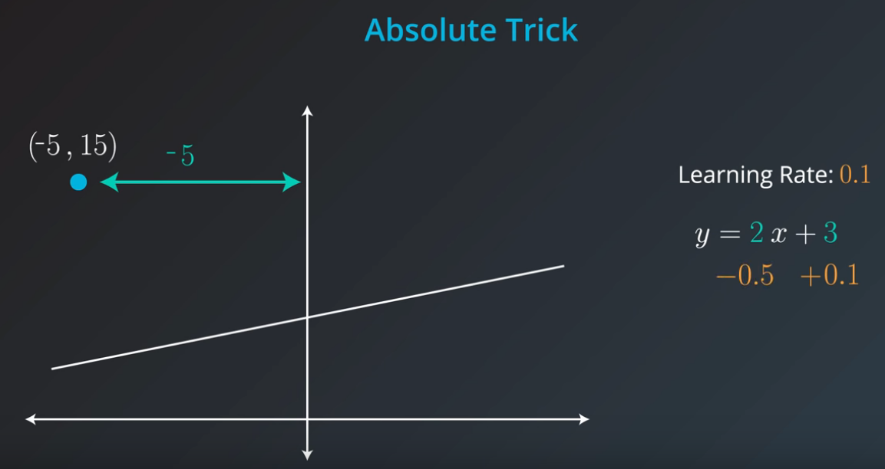

<center><em>Figure 3 - Second Quadrant Issue.</em></center>

For this reason, the $p$ value is conveniently used to fit the line. When the $p$ is positive the slope should have $\alpha$ added and when it is negative the $\alpha$ should be subtracted to the slope.

$$y = (w_1 + p \cdot \alpha ) \cdot x + (w_2 + \alpha ) \tag{5}$$

This is an Example of Absolute Trick.

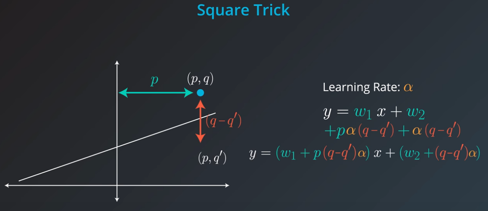

<center><em>Figure 4 - Absolute Trick Numeric Example.</em></center>

#### Square Trick

The Square trick is similar to the Absolute with the difference of also uses the $q$ value of the "target" point $(p,q)$ in the process to fit the line closer to the target.

In this strategy we going to use the difference between $q$ and the closest point from the line to it, thw $q'$, so what we are going to use is the $(q-q')$. Figure 5 shows it.


<center><em>Figure 5 - Using the q and q'.</em></center>

Equation (6) shows the new formulation.

$$y = (w_1 + p \cdot (q - q') \cdot \alpha ) \cdot x + (w_2 + (q - q') \cdot \alpha ) \tag{6}$$

**Example:**

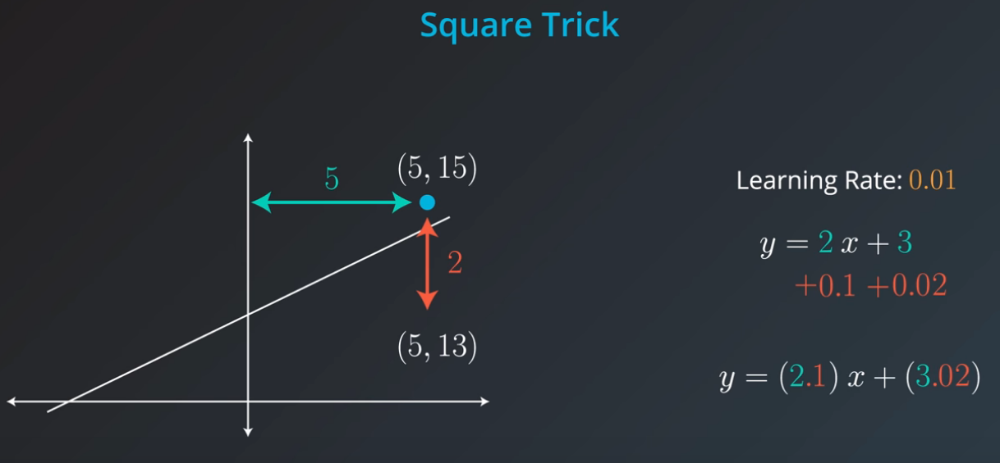

<center><em>Figure 6 - Square Trick Numeric Example.</em></center>

The advantages of this approach are the negatives values and points in second quadrants are all contemplated in a single formulation.

### Gradient Descent

The Gradient Descent is a way to find an optimized solution using derivates. For a given point and updating it by the derivates it is possible to find the way/toward the optimized solution. Doing so recurrently you will find a solution very close to the optimal.

>A gradient measures how much the output of a function changes if you change the inputs a little bit. <cite>Lex Fridman (MIT)</cite>

To ilustrate this concept, Figure 7 shows a picuture, which describe the process.

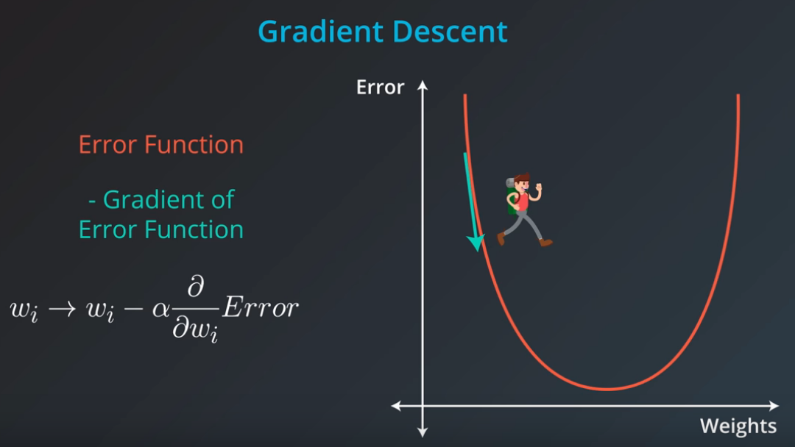

<center><em>Figure 7 - Gradient Descent.</em></center><br>

The theory behind the scenes is presented in equation (7)

$$w_{next\_position,i} = w_{actual,i} - \alpha \frac{\partial}{\partial w_i}Error \tag{7}$$

Where:

* $\alpha$: Learning rate;
* $w_{next\_position,i}$: The new coordinate, and;
* $w_{actual,i}$: The actual position.

Bear in mind, this example above only deal with one variable (in this case called $i$), this process should done for each feature of the model.

In Linear Regression the Gradient Descent is applied to minimize the error associated in the fitted line. Although it is possible to find the optimal solution analytically, sometimes the number of features is so huge that turns it very time-consuming. For this reason, the approximated solution using Gradient Descent is acceptable.

The $error$ definition is the distance between the point and the fitted line. Figure 8 shows it.

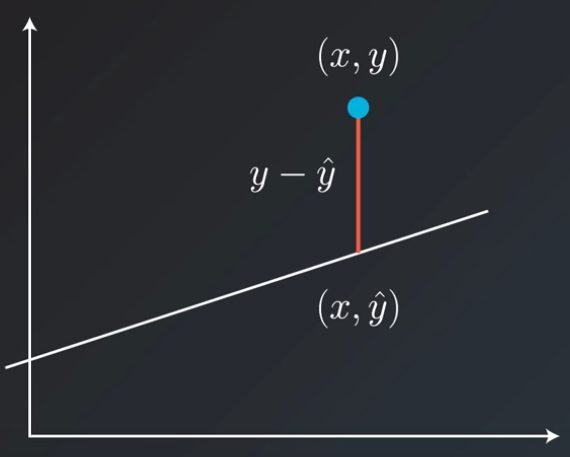

<center><em>Figure 8 - Deinition of error.</em></center><br>

The **objective function** of the Linear Regression is to minimize this error, but, have in mind, in a regular Linear Regression there is many points to fit and the objective function is a bit more complicated, which could be formulated as a summation of errors.

$$Error_i = \sum_{i=1}^{m} error_i \tag{8}$$

Where:

* $m$: Total number of points.

Additional Sources about Gradient Descent.

* [TowardsScience][ref_gradient_descent]
* [Hackernoon][ref_hackernoon_gradient_descent]

#### Mean Absolute Error

As you can see, the error could be positive and negative, which could lead us to annulate the positive with the negative. To avoid this weird behaviour, I should use the absolute value. The equation (9) shows an updated version of equation (8) to the application of Mean Absolute Error.

$$\text{Error} = \sum_i^{m} |y - \hat y| \tag{9}$$

Where:

* $y$: The actual point, and;
* $\hat y$: The "predicted" point.

Figure 9 shows the final formualtion of Mean Absolute Error.

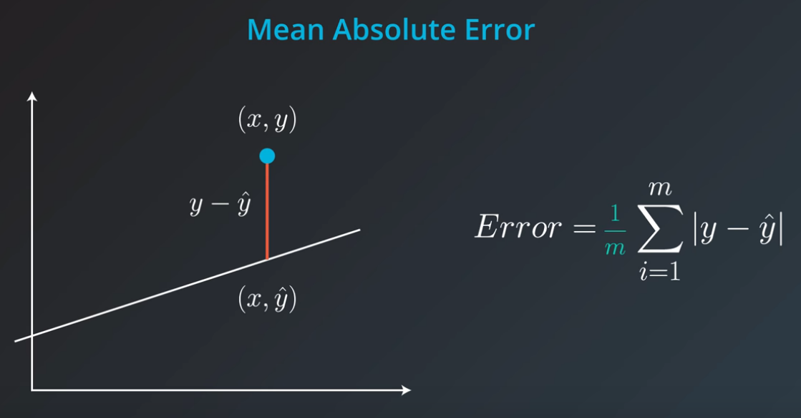

<center><em>Figure 9 - Mean Absolute Error.</em></center><br>

Just updating the equation (9) dividing it by $\frac{1}{m}$. Now, it is a **mean** of the error.

$$\text{Mean Absolute Error} = \frac{1}{m} \sum_i^{m} |y - \hat y| \tag{9}$$

#### Mean Squared Error

The Mean Squared Error is very similiar with the Mean Absolute Error, as you can see in Figure 10.

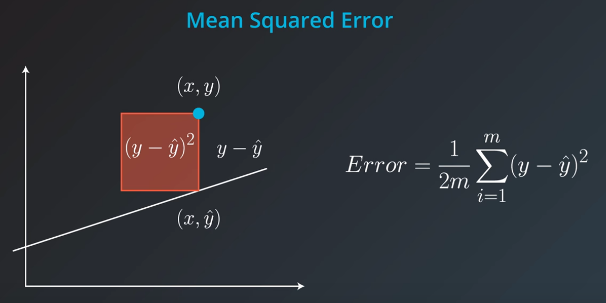

<center><em>Figure 10 - Mean Squared Error.</em></center><br>

The advantages to use this approach is the error will be always positive, which mean I do not need to use absolute values. The Equation 10 shows the way to calculate the Mean Square Error.

$$\text{Mean Squared Error} = \frac{1}{2m} \sum_i^{m} (y - \hat y)^2 \tag{10}$$

Have in mind, there is no problem to multiply the error by any constant, this is the reason to adopt arbitrarily the $\frac{1}{2m}$ or $\frac{1}{2}$, the Gradient Descent will work equally. This is just a formality when we derivate the equantions (9) and (10).

#### Minimizing Error Functions

Now, let's tie the concepts of Absolute Trick and Square Trick in the Error minimization process of a Linear Regression.

**Absolute Trick**

Recall the equation of $\hat y$.

$$\hat y = w_1 x + w_2 \tag{1}$$

Recall the mean absolute error equation.

$$Error = \frac{1}{m} \sum_{i}^{m} |y_i - \hat y_i| \tag{9}$$

Now, substitute equation (1) in (9).

$$Error = \frac{1}{m} \sum_{i}^{m} |y_i - w_1 x_i + w_2| \tag{11}$$

Let's derive equation (11) by $w_1$.

$$\frac{\partial}{w_1} Error = \frac{1}{m} |m \cdot x_i| = \pm x\tag{12}$$

The same to $w_2$.

$$\frac{\partial}{w_2} Error = \frac{1}{m} |m \cdot 1| = \pm 1\tag{13}$$

Figure 11 shows an ilustration about it.

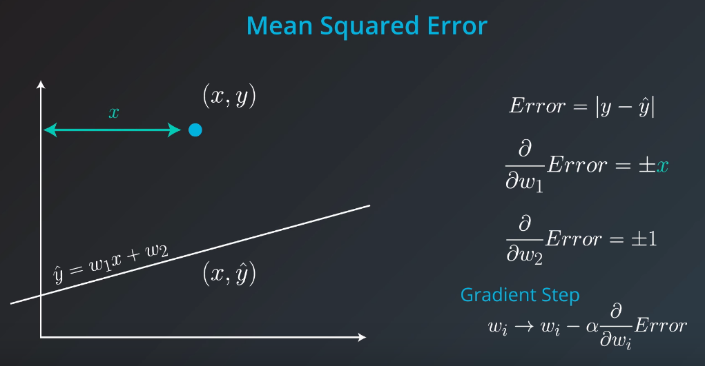

<center><em>Figure 11 - Relationship between Absolute Trick and Mean Absolute Error.</em></center><br>

Thus updating the $w_1$ and $w_2$.

$$\hat y = (w_1 \pm x) \cdot x + (w_2 \pm 1) \tag{14}$$

Assuming a learning rate of $\alpha$.

$$\hat y = (w_1 \pm x \cdot \alpha) \cdot x + (w_2 \pm 1 \cdot \alpha) \tag{15}$$

For a given $(p,q)$ point positioned in the first quadrant.

$$\hat y = (w_1 + p \cdot \alpha) \cdot x + (w_2 + \alpha) \tag{16}$$

In case of points in the second quadrant the sign should be changed to minus.

**Squared Trick**

The process is the same presented to the Absolute Trick and Mean Absolute Error.

The partials derivates.

$$\frac{\partial}{w_1} Error = \frac{1}{2m} \{m[2(0-x)(y - \hat y)]\} = -(y - \hat y)x \tag{17}$$

$$\frac{\partial}{w_2} Error = \frac{1}{2m} \{m[2(0-1)(y - \hat y)]\} = -(y - \hat y) \tag{18}$$

Figure 12 shows an ilustration about it.

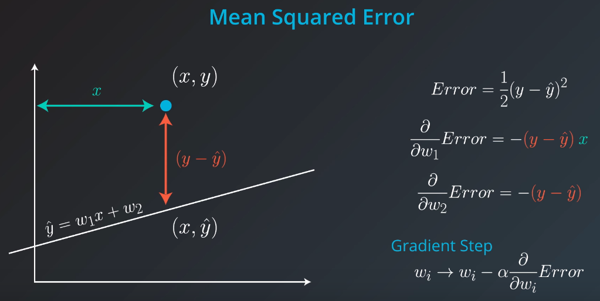

<center><em>Figure 12 - Relationship between Squared Trick and Mean Square Error.</em></center><br>

Assuming Learning rate of $\alpha$ and a generic point $(p,q)$.

$$\hat y = (w_1 + (q - \hat q) \cdot p \cdot \alpha) \cdot x + (w_2 + (q - \hat q) \cdot \alpha) \tag{19}$$

Where:

* If ($q - \hat q$) is positive: It is necessary to increase the slope. Adding a small value in the slope;
* If ($q - \hat q$) is negative: It is necessary to decrease the slope. Subtracting a small value of the slope.

#### Mean vs Total Error

The difference between these two term is a constant. Thus this going to change the learning rate and nothing else.

#### Batch or Stochastic

There are three ways to perform the Linear Regression:

* Batch Gradient Descent or Vanilla Gradient Descent;
* Stochastic Gradient Descent, and;
* Mini Batch Gradient Descent.

**Batch Gradient Descent**

>Batch Gradient Descent, also called vanilla gradient descent, calculates the error for each example within the training dataset, but only after all training examples have been evaluated, the model gets updated. This whole process is like a cycle and called a training epoch.
>
>Advantages of it are that it’s computational efficient, it produces a stable error gradient and a stable convergence. Batch Gradient Descent has the disadvantage that the stable error gradient can sometimes result in a state of convergence that isn’t the best the model can achieve. It also requires that the entire training dataset is in memory and available to the algorithm. -- <cite>[TowardsScience][ref_gradient_descent]</cite>

**Stochastic Gradient Descent**

>Stochastic gradient descent (SGD) in contrary, does this for each training example within the dataset. This means that it updates the parameters for each training example, one by one. This can make SGD faster than Batch Gradient Descent, depending on the problem. One advantage is that the frequent updates allow us to have a pretty detailed rate of improvement.
>
>The thing is that the frequent updates are more computationally expensive as the approach of Batch Gradient Descent. The frequency of those updates can also result in noisy gradients, which may cause the error rate to jump around, instead of slowly decreasing. -- <cite>[TowardsScience][ref_gradient_descent]</cite>

**Mini Batch Gradient Descent**

>Mini-batch Gradient Descent is the go-to method since it’s a combination of the concepts of SGD and Batch Gradient Descent. It simply splits the training dataset into small batches and performs an update for each of these batches. Therefore it creates a balance between the robustness of stochastic gradient descent and the efficiency of batch gradient descent.
>
>Common mini-batch sizes range between 50 and 256, but like for any other machine learning techniques, there is no clear rule, because they can vary for different applications. Note that it is the go-to algorithm when you are training a neural network and it is the most common type of gradient descent within deep learning. -- <cite>[TowardsScience][ref_gradient_descent]</cite>

The question is, which one is used in practice?

>Actually, in most cases, neither. Think about this: If your data is huge, both are a bit slow, computationally. The best way to do linear regression, is to split your data into many small batches. Each batch, with roughly the same number of points. Then, use each batch to update your weights. This is still called mini-batch gradient descent. -- <cite>Class notebook</cite>


[ref_gradient_descent]: https://towardsdatascience.com/gradient-descent-in-a-nutshell-eaf8c18212f0
[ref_hackernoon_gradient_descent]: https://hackernoon.com/gradient-descent-aynk-7cbe95a778da

### Absolute Error or Squared Error

The Absolute Error has ambiguity and you can see it in Figure 13.

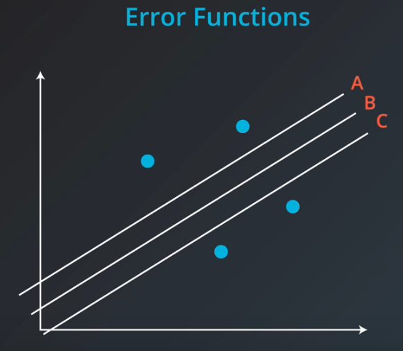

<center><em>Figure 13 - Absolute Error Ambiguity.</em></center><br>

You can not determine which of these three line is better because these three lines have the same total error using the Absolute Error. Though, the Squared Error has only one solution for this same problem.

### Linear Regression in Scikit Learn

The Scikit Learn package has a module to performs the Linear Regression.

```r
# Importing the module of Scikit Learn.
from sklearn.linear_model import LinearRegression
```
#### classifier

How to create the object.
```r
# Creating the object.
model = LinearRegression()
```

#### Training

Training my model.
```r
model.fit(feature_train, label_train)
```
#### Predicting

```r
# Predicting after training the model.
model.predict(feature_test, label_test)
```
### Higher Dimensions or Multiple Linear Regression

Let's expand the principle to more variables than two.

$$\hat y = w_1 \cdot x_1 + w_2 \cdot x_2 + w_3 \tag{20}$$

Where:

* $w_1$, $w_2$, and $w_3$: Coefficientes;
* $x_1$ and $x_2$: Variables.

Let's derive to create the Gradient Descent.

$$\frac{\partial}{w_1}Error = \frac{1}{2m} \cdot 2 \cdot [m \cdot (y - x_1 \cdot 1 - 0 - 0) \cdot (y - \hat y)] = -(y - \hat y) \cdot x_1 \tag{21}$$

$$\frac{\partial}{w_2}Error = \frac{1}{2m} \cdot 2 \cdot [m \cdot (y - 0 - x_2 \cdot 1 - 0) \cdot (y - \hat y)] = -(y - \hat y) \cdot x_2 \tag{22}$$

$$\frac{\partial}{w_3}Error = \frac{1}{2m} \cdot 2 \cdot [m \cdot (y - 0 - 0 - 1) \cdot (y - \hat y)] = -(y - \hat y) \tag{23}$$

It is possible to change the notation of equation (20).

$$\hat y = \begin{bmatrix} x_1 \ x_2 \ 1 \end{bmatrix}
\cdot \begin{bmatrix} w_1 \\ w_2 \\ w_3 \end{bmatrix} = X \cdot W \tag{24}$$

Now, let's update the $W$ vector, the parameters vector.

$$W_{next\_position} = \begin{bmatrix} w_1 + \frac{\partial Error}{w_1} \\ w_2 + \frac{\partial Error}{w_2} \\ w_3  + \frac{\partial Error}{w_3}\end{bmatrix} \tag{25}$$

Adding the learning rate of $\alpha$.

$$\hat y_{next\_position} = \alpha \cdot \begin{bmatrix} x_1 \ x_2 \ 1 \end{bmatrix}
\cdot \begin{bmatrix} w_1 + \frac{\partial Error}{w_1} \\ w_2 + \frac{\partial Error}{w_2} \\ w_3  + \frac{\partial Error}{w_3}\end{bmatrix} \tag{26}$$

This is a simple example using three variables.

### Linear Regression Warnings

>Linear regression comes with a set of implicit assumptions and is not the best model for every situation. Here are a couple of issues that you should watch out for.
>
>**Linear Regression Works Best When the Data is Linear**
>Linear regression produces a straight line model from the training data. If the relationship in the training data is not really linear, you'll need to either make adjustments (transform your training data), add features (we'll come to this next), or use another kind of model. -- <cite>Udacity Class notebook</cite>


<center><em>Figure 14 - Non-linear Data.</em></center><br>

>**Linear Regression is Sensitive to Outliers**
>Linear regression tries to find a 'best fit' line among the training data. If your dataset has some outlying extreme values that don't fit a general pattern, they can have a surprisingly large effect. -- <cite>Udacity Class notebook</cite>

### Polynomial Regression.

This kind of Regression is when the order of the variables is greater than one.

$$\hat y = 2x^3 + 8x^2-5x+4\tag{27}$$

The process is the same.

1) Calculating the Errors;
2) Derivating;
3) Updating the parameters.

### Regularization


<center><em>Figure 14 - Comparison Lasso (L1) and Ridge (L2).</em></center><br>

.
