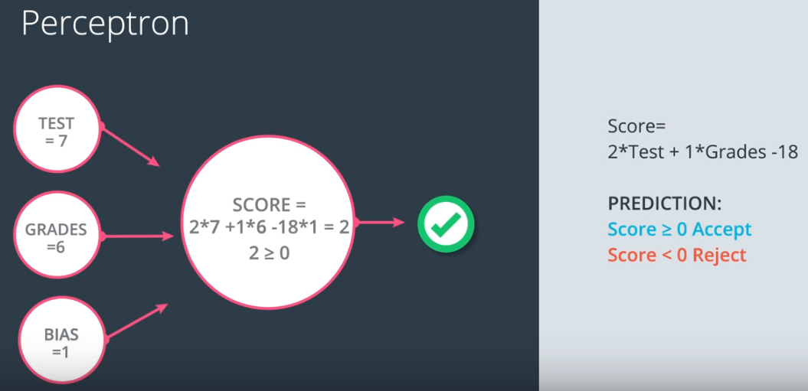
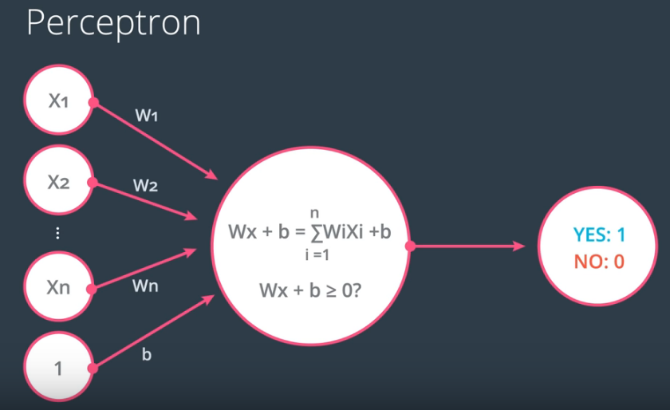
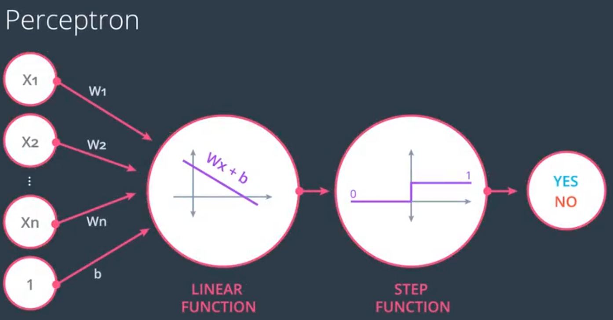
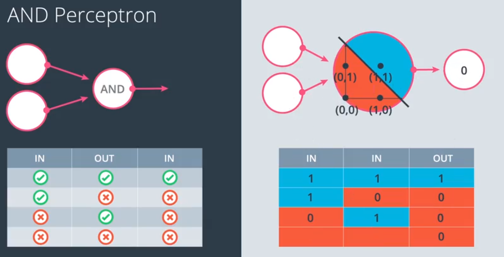

# ND025 - Supervised Learning

#### Tags
* Author : AH Uyekita
* Title  :  _Perceptron Algorithm_
* Date   : 05/03/2019
* Course : Data Scientist Nanodegree Program
    * COD    : ND025
    * **Instructor:** Luis Serrano

***

## Perceptron

The Perception is the elementary component of the Neural Network. It is similar to the Linear Regression but aiming to perform the classification instead of a predict a value. Figure 1 shows an example.

<em>Figure 1 - Classification Problem Example.</em>

By the using of the adopt model (a Linear Equation) it is possible to classify (or predict) if a student will be accept or reject. Figure 2 shows the simplified notation of the Perceptron.

<em>Figure 2 - Perceptron Diagram.</em>

The representation also could be modified adding the `Bias`.

<em>Figure 3 - Perceptron Diagram with Bias representation.</em>

Finally, the generalization of the Perceptron Algorithm has presented in Figure 3.

<em>Figure 4 - Perceptron Diagram Generalization.</em>

Have in mind, for this example there is an implicit step function applied to perform the classification. Figure 5 shows it.

<em>Figure 5 - Step Function.</em>

This is a similar way to evaluate the output as the sigmoid function performs in Logistic Regression. In later algorithm, we are going to use different "step functions".

### Logical Operator

It is possible to use Perceptrons to act as a logical operators.

#### `AND` Operator

The `AND` operator could be create using the following equation.

$$W \cdot x = y \tag{1}$$

Where:

* $x$: Inputs;
* $y$: Output;
* $W$: Weights, and;
* $b$: Intercept.

Let's define the $W$ (coefficients). These coefficients are conveniently selected.

$$W = \begin{bmatrix} -30 & 20 & 20 \end{bmatrix}$$

Updating equation (1).

$$y^{(i)} = \begin{bmatrix} -30 & 20 & 20 \end{bmatrix} \cdot \begin{bmatrix} 1 \\ x_1 \\ x_2 \end{bmatrix} \tag{2}$$

Where:

* $y^{(i)}$: Is a set of input $y(x_1,x_2)$.

Computing the values. Table 1 shows the values from the $y$.

<strong>Table 1 - AND Truth Table using Perceptrons.</strong>

|x_1|x_2|Equation|y|Classification|
|:-:|:-:|:-:|:-:|:-:|
|0|0|-30 + 0 + 0|-30|0|
|0|1|-30 + 0 + 20|-10|0|
|1|0|-30 + 20 + 0|-10|0|
|1|1|-30 + 20 + 20|10|1|

Have in mind, I could use the regular step function or a sigmoid function for this classification. Figure 6 shows an illustration of the AND Perceptron.

<em>Figure 6 - Logical AND.</em>

#### `OR` Operator

Analogous to the `AND` logical. I should selected conveniently values to create this port. Equation (3) shows it.

$$y^{(i)} = \begin{bmatrix} -10 & 20 & 20 \end{bmatrix} \cdot \begin{bmatrix} 1 \\ x_1 \\ x_2 \end{bmatrix} \tag{3}$$

<strong>Table 2 - OR Truth Table using Perceptrons.</strong>

|x_1|x_2|Equation|y|Classification|
|:-:|:-:|:-:|:-:|:-:|
|0|0|-10 + 0 + 0|-10|0|
|0|1|-10 + 0 + 20|10|1|
|1|0|-10 + 20 + 0|10|1|
|1|1|-10 + 20 + 20|30|1|

#### `NOT` Operator

Instead of two inputs this operator only needs one.

$$y^{(i)} = \begin{bmatrix} 10 & -20 \end{bmatrix} \cdot \begin{bmatrix} 1 \\ x_1 \end{bmatrix} \tag{4}$$

<strong>Table 3 - NOT Truth Table using Perceptrons.</strong>

|x_1|Equation|y|Classification|
|:-:|:-:|:-:|:-:|
|0|10 + 0|10|1|
|1|10 - 20|-10|0|

#### `XOR` Operator

The `XOR` gate could be obtained binding two other gates, as shown in Figure 7.

<em>Figure 7 - XOR Gate.</em>

As you can see, the XOR gate is a composition of `NAND` and `OR` gates. For this reason, I have to use one hidden layer, which will be represented by $a_1$ and $a_2$. Table 4 presents the Truth table.

<strong>Table 4 - XOR Truth Table using Perceptrons to create the XOR gate.</strong>

|x_1|x_2|a_1 = x_1 or x-2|a_2 = NOT(x_1 and x_2)|XOR = a_1 and a_2|
|:-:|:-:|:-:|:-:|:-:|
|0|0|0|1|0|
|0|1|1|1|1|
|1|0|1|1|1|
|1|1|1|0|0|

Let's start from the output defining the output as an `AND` gate of $a_1$ and $a_2$.

$$y^{(i)} = \begin{bmatrix} -30 & 20 & 20 \end{bmatrix} \cdot \begin{bmatrix} 1 \\ a_1 \\ a_2 \end{bmatrix} \tag{5}$$

Have in mind, the $a_n$ should be a boolean, for this reason, I must use the step function.

$$a_n = h(z_n) \tag{6}$$

Where:

* $h()$: Step function.

So, let's define $z_1$ and $z_2$.

* $z_1$: The `NAND` gate.

$$z_1^{(1)} = \begin{bmatrix} 30 & -20 & -20 \end{bmatrix} \cdot \begin{bmatrix} 1 \\ x_1 \\ x_2 \end{bmatrix} \tag{7}$$

* $z_2$: The `OR` gate.

$$z_2^{(1)} = \begin{bmatrix} -10 & 20 & 20 \end{bmatrix} \cdot \begin{bmatrix} 1 \\ x_1 \\ x_2 \end{bmatrix} \tag{8}$$

Finally, I could replace $a_1$ and $a_2$ of equation (5) by (6), (7), and (8).

$$y^{(i)} = \begin{bmatrix} -30 & 20 & 20 \end{bmatrix} \cdot \begin{bmatrix} 1 \\ h(z_1^{(1)}) \\ h(z_2^{(1)}) \end{bmatrix}$$

$$y^{(i)} = \begin{bmatrix} -30 & 20 & 20 \end{bmatrix} \cdot \begin{bmatrix} 1 \\ h(30 - 20x_1 - 20x_2) \\ h(-10 + 20x_1 + 20x_2) \end{bmatrix} \tag{9}$$
