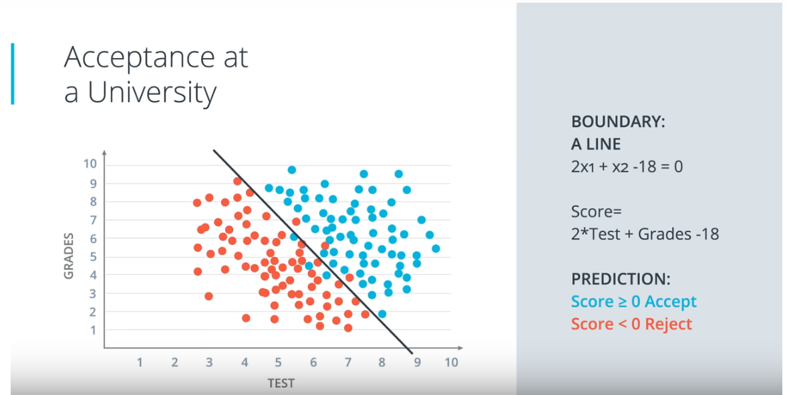
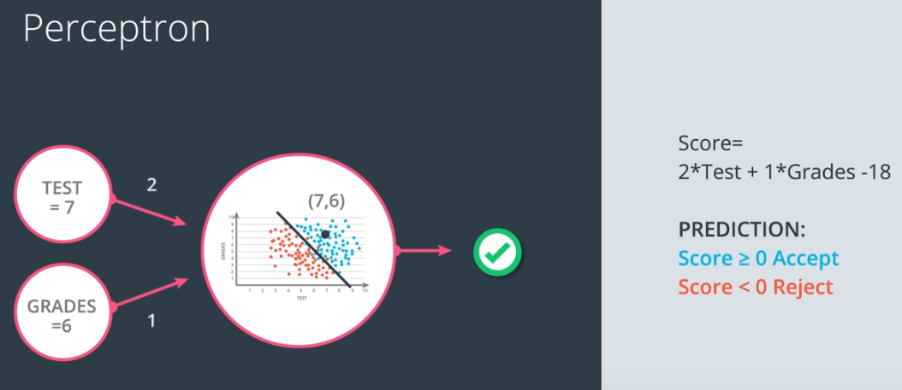

# ND025 - Supervised Learning

#### Tags
* Author : AH Uyekita
* Title  :  _Perceptron Algorithm_
* Date   : 05/03/2019
* Course : Data Scientist Nanodegree Program
    * COD    : ND025
    * **Instructor:** Luis Serrano

***

## Perceptron

The Perception is the elementary component of the Neural Network. It is similar to the Linear Regression but aiming to perform the classification instead of a predict a value. Figure 1 shows an example.

<em>Figure 1 - Classification Problem Example.</em>

By the using of the adopt model (a Linear Equation) it is possible to classify (or predict) if a student will be accept or reject. Figure 2 shows the simplified notation of the Perceptron.

<em>Figure 2 - Perceptron Diagram.</em>

.
