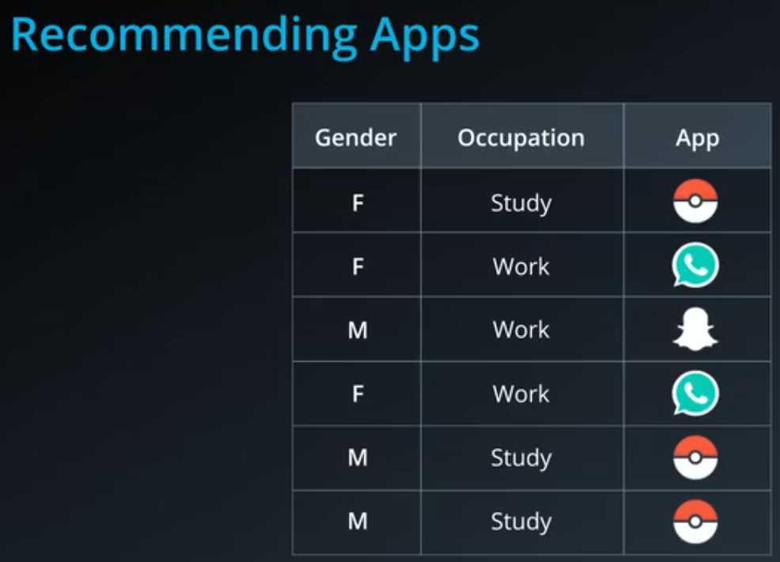
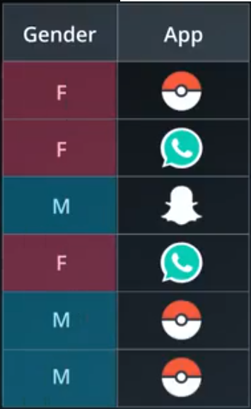
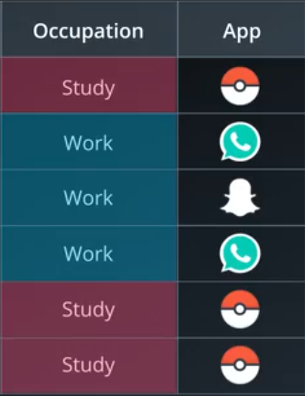
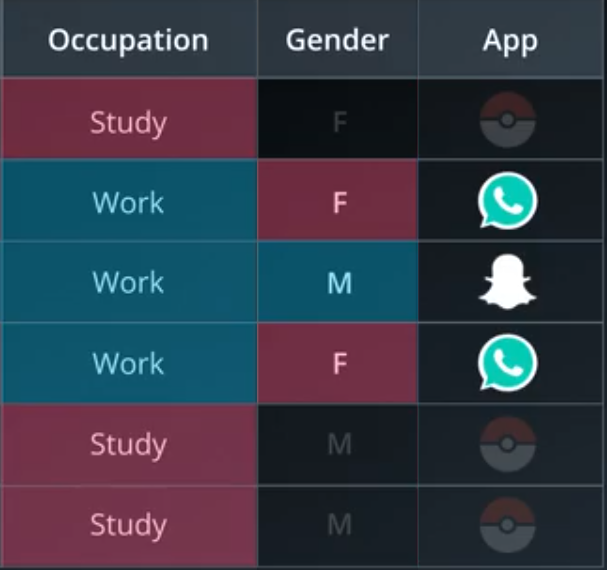
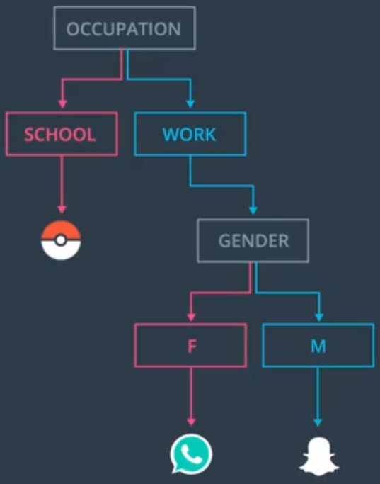
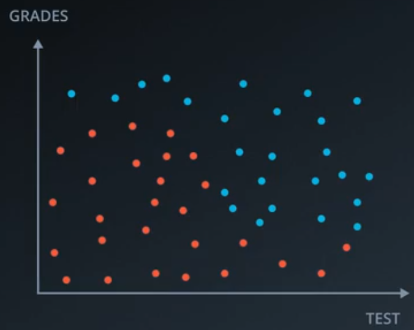
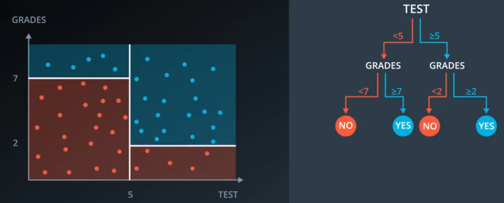
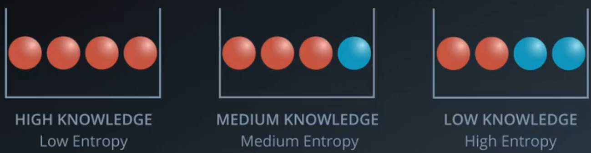

# ND025 - Supervised Learning - Lesson 03

#### Tags
* Author : AH Uyekita
* Title  :  _Decision Trees_
* Date   : 18/03/2019
* Course : Data Scientist Nanodegree Program
    * COD    : ND025
    * **Instructor:** Luis Serrano

***

## Decision Trees

An example of this algorithm is the [Akinator Website][akinator_url], which works asking several questions and they could "predict" the person you are thinking.

[akinator_url]: https://en.akinator.com/game

Founded on this example above, let's try to create a recommender system. Table 1 shows the variables Gender and Occupation and the App downloaded by the user.

<em>Figure 1 - Recommending Apps.</em>

The two variables, gender and Occupation, should be used as inputs to "guess" the most likely App downloaded by these kind of person.

>Which variable should I use first?

or

>Between Gender and Occupation, which one seems more decisive of predicting what app will the users Download?

Let's have a look to the Gender.

<em>Figure 2 - Splitting by Gender.</em>

Using `Gender` do not explain much about our aiming. Let's have a look splitting by Occupation.

<em>Figure 3 - Splitting by Occupation.</em>

Now, using the `Occupation` it is possible to visualize a clear pattern, when the user is a student, they usually download Pokémon Go. We *gain more information* using `Occupation`.

Continuing the split process, let's use the last variable.

<em>Figure 4 - Splitting by Occupation and later by Gender.</em>

You can divide the observation into 2 classes:

* female: prone to download WhatsApp, and;
* male: more likely to download Snapchat.

<em>Figure 5 - The tree.</em>

The example above is about the classification process of using categorical variables/features. Now, let's try it using continuous features.

<em>Figure 6 - Student Admissions.</em>

Where:

* `Blue`: Accepted, and;
* `Red`: Rejected.

Here, I have posed the same question.

> Between grades and test, which one determines students acceptance better?

Or rephrasing it.

> Between a horizontal and a vertical line, which one woould cut the data better?

In this time we need to determine the _threshold_, which provide the better split. Figure 7 shows the final Decision Tree.

<em>Figure 7 - Student Admissions Decision Tree.</em>

The best feature to split in the first time is `test` and the optimized value is `5`. Later, there are two subsets, which I should perform the same procedure for each part. Thus, two new splits in `2` and `7` will be performed.

### Entropy

Have in mind, the entropy concept used in this subject is related to the [Information Theory][wiki_entropy_info], but has some similiraties with the Entropy of the Physics.

[wiki_entropy_info]: https://en.wikipedia.org/wiki/Entropy_(information_theory)

Here Entropy is a way to evaluate the split quality, so our focus here is to find an optimized way to divide the data into "two" groups. Each group could be evaluate by its "Knowledge", which is the "opposite" of entropy. Figure 8 shows an illustration of it.

<em>Figure 8 - Entropy and Knowledge.</em>
 

From the left to right, the first bucket is homogeneous so the entropy is low because there is no messy in it. The second bucket is quite homogeneous also with only one ball blue, so the entropy is medium. Lastly, the third bucket has fifty-fity, which I could classify as high.

.
