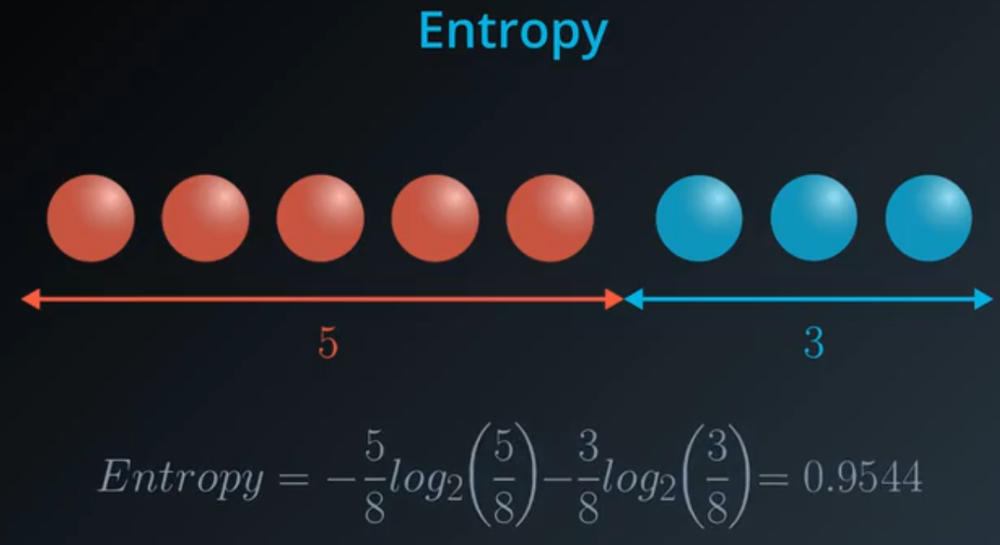
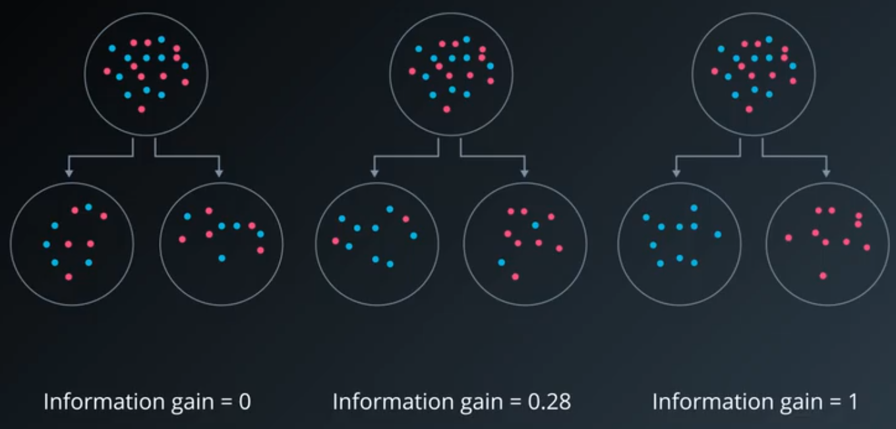
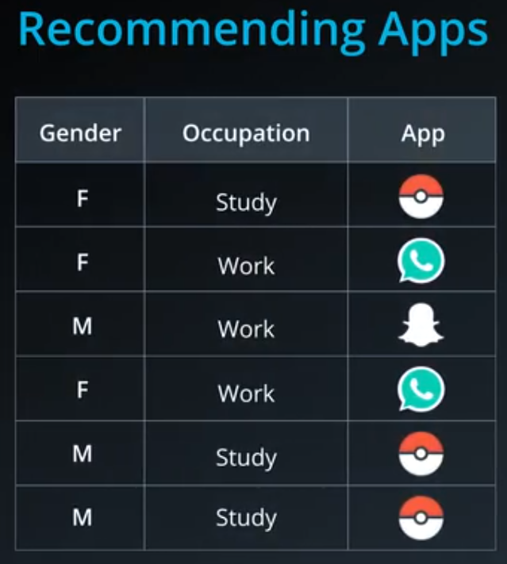
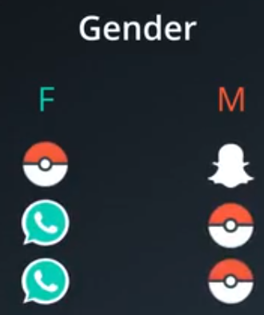
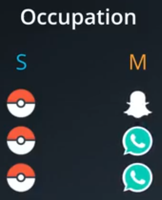
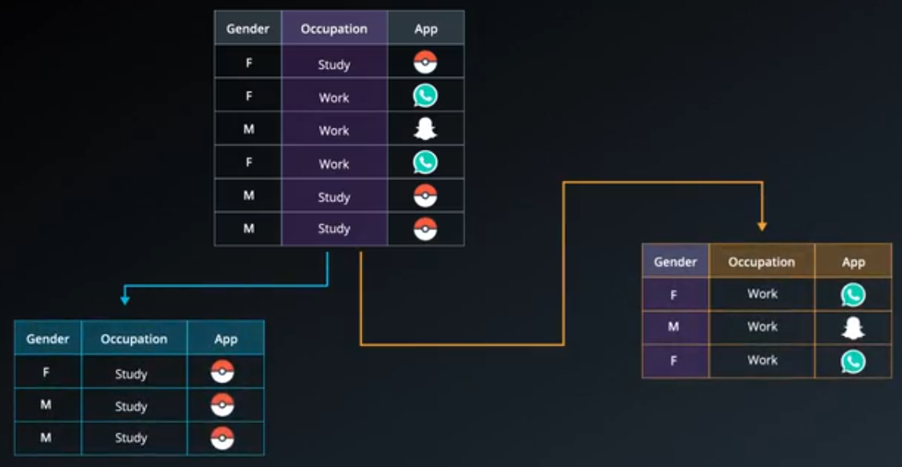
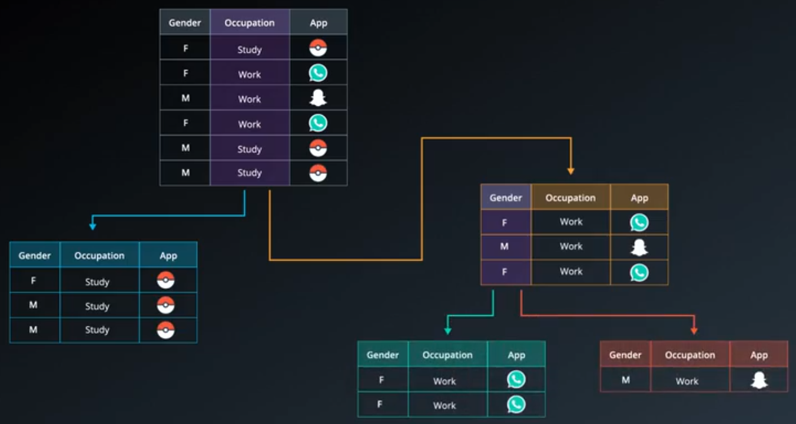

# ND025 - Supervised Learning - Lesson 03

#### Tags
* Author : AH Uyekita
* Title  :  _Decision Trees_
* Date   : 18/03/2019
* Course : Data Scientist Nanodegree Program
    * COD    : ND025
    * **Instructor:** Luis Serrano

***

## Decision Trees

An example of this algorithm is the [Akinator Website][akinator_url], which works asking several questions and they could "predict" the person you are thinking.

[akinator_url]: https://en.akinator.com/game

Founded on this example above, let's try to create a recommender system. Table 1 shows the variables Gender and Occupation and the App downloaded by the user.

<em>Figure 1 - Recommending Apps.</em>

The two variables, gender and Occupation, should be used as inputs to "guess" the most likely App downloaded by these kind of person.

>Which variable should I use first?

or

>Between Gender and Occupation, which one seems more decisive of predicting what app will the users Download?

Let's have a look to the Gender.

<em>Figure 2 - Splitting by Gender.</em>

Using `Gender` do not explain much about our aiming. Let's have a look splitting by Occupation.

<em>Figure 3 - Splitting by Occupation.</em>

Now, using the `Occupation` it is possible to visualize a clear pattern, when the user is a student, they usually download Pokémon Go. We *gain more information* using `Occupation`.

Continuing the split process, let's use the last variable.

<em>Figure 4 - Splitting by Occupation and later by Gender.</em>

You can divide the observation into 2 classes:

* female: prone to download WhatsApp, and;
* male: more likely to download Snapchat.

<em>Figure 5 - The tree.</em>

The example above is about the classification process of using categorical variables/features. Now, let's try it using continuous features.

<em>Figure 6 - Student Admissions.</em>

Where:

* `Blue`: Accepted, and;
* `Red`: Rejected.

Here, I have posed the same question.

> Between grades and test, which one determines students acceptance better?

Or rephrasing it.

> Between a horizontal and a vertical line, which one woould cut the data better?

In this time we need to determine the _threshold_, which provide the better split. Figure 7 shows the final Decision Tree.

<em>Figure 7 - Student Admissions Decision Tree.</em>

The best feature to split in the first time is `test` and the optimized value is `5`. Later, there are two subsets, which I should perform the same procedure for each part. Thus, two new splits in `2` and `7` will be performed.

### Entropy

Have in mind, the entropy concept used in this subject is related to the [Information Theory][wiki_entropy_info], but has some similiraties with the Entropy of the Physics.

[wiki_entropy_info]: https://en.wikipedia.org/wiki/Entropy_(information_theory)

Here Entropy is a way to evaluate the split quality, so our focus here is to find an optimized way to divide the data into "two" groups. Each group could be evaluate by its "Knowledge", which is the "opposite" of entropy. Figure 8 shows an illustration of it.

<em>Figure 8 - Entropy and Knowledge.</em>
 

From the left to right, the first bucket is homogeneous so the entropy is low because there is no output different of red. The second bucket is quite homogeneous also with only one ball blue, so the entropy is medium. Lastly, the third bucket has fifty-fifty, which I could classify as high.

The general equation to calculate the Entropy is presented in Equation (1):

$$\text{Entropy} = - (\frac{x}{x+y}) \log_2(\frac{x}{x+y}) - (\frac{y}{x+y}) \log_2(\frac{y}{x+y}) \tag{1}$$

As you can see, Equation (1) is a weighted average of the probabilities of each state. Figure 9 shows an example with numbers.

<em>Figure 9 - Numeric example of Entropy Calculation.</em>
 

#### Information Gain

Now, it is possible to introduce the Information Gain concept, which is founded on the difference between Entropies of the parents and children. Equation (2) shows the simple way to calculate information gain.

$$\text{Information Gain} = Entropy_{parents} - \frac{(Entropy_{child,1} + Entropy_{child,2})}{2} \tag{2}$$

So, the interpretation of this equation is the Information Gain represents the difference between the Entropy of the parents minus the average Entropies of the children. Figure 10 shows the visual explanation.

<em>Figure 10 - Information Gain.</em>
 

The situation with the highest Information Gain is the most-right because it is possible to divide de data without any mistake. On the other hand, the most-left is the worse one.

#### Example

Figure 11 shows the dataset of this example.

<em>Figure 11 - Example.</em>
 

Let's calculate the Parents Entropy, in this case `App` column, which is our labels.

<em>Figure 12 - Parents Entropy.</em>
 

$$\text{Entropy}_{parents} = -\frac{3}{6}\log_{2}(\frac{3}{6}) -\frac{2}{6}\log_{2}(\frac{2}{6}) -\frac{1}{6}\log_{2}(\frac{1}{6})$$
$$\text{Entropy}_{parents} = 1.46 \tag{3}$$

Going further in our Decision Trees, the next split we need to evaluate two variables: Gender and Occupation.

**Gender**

<em>Figure 13 - Gender Entropy.</em>
 

As you can see, both sides are equally, for this reason both entropies will be the same.

$$\text{Entropy}_{gender,F} = -\frac{1}{3} \log_{2}(\frac{1}{3}) -\frac{2}{3} \log_{2}(\frac{2}{3})$$
$$\text{Entropy}_{gender,M} = \text{Entropy}_{gender,F} = 0.92 \tag{4}$$

So, the Gender Entropy Average is `0.92`.

**Occupation**

<em>Figure 14 - Occupation Entropy.</em>
 

In this case, the entropies of each child is different.

$$\text{Entropy}_{occupation,S} = -\frac{3}{3} \log_{2}(\frac{3}{3}) = 0$$

$$\text{Entropy}_{occupation,M} = -\frac{1}{3} \log_{2}(\frac{1}{3}) -\frac{2}{3} \log_{2}(\frac{2}{3}) = 0.92$$

So, the Occupation Entropy Average is `0.46`.

**Information Gain**

Calculating the Information Gain:

* $ \text{Entropy}_{parents} - \text{Entropy}_{gender} = 1.46 - 0.92 = 0.54$
* $ \text{Entropy}_{parents} - \text{Entropy}_{occupation} = 1.46 - 0.46 = 1.00$

The algorithm says to take the feature with the highest Information Gain, so the `Occupation` should be selected. Figure 15 shows the split.

<em>Figure 15 - Splitting using Occupation.</em>
 

Finally, we can split using the Gender, as you can see in Figure 16.

<em>Figure 16 - Splitting by Gender.</em>
 
