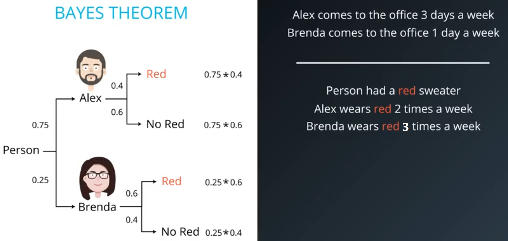
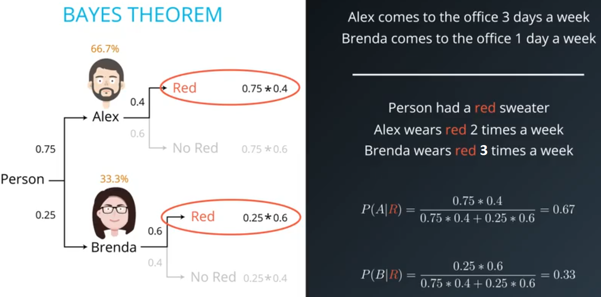
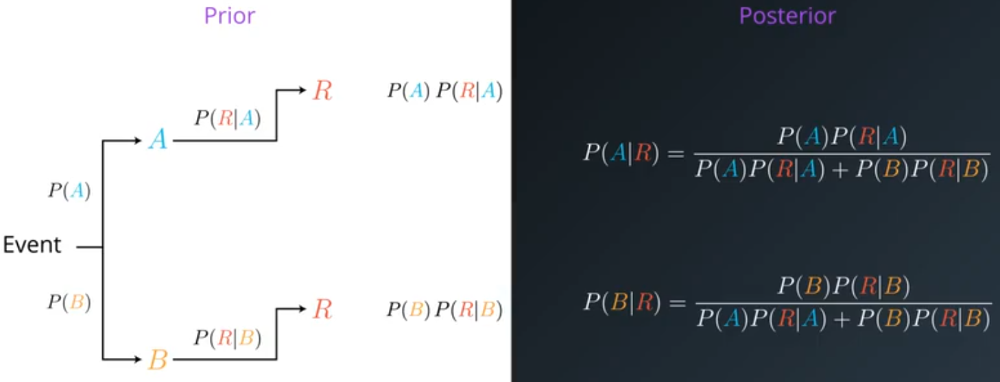

# ND025 - Supervised Learning - Lesson 04

#### Tags
* Author : AH Uyekita
* Title  :  _Naïve Bayes_
* Date   : 30/03/2019
* Course : Data Scientist Nanodegree Program
    * COD    : ND025
    * **Instructor:** Luis Serrano

***

## Naïve Bayes

This algorithm is based on conditional probabilities to predict. The concept underlying this algorithm is to use a prior probability and an event to infer posteriors probabilities.

**Example**

* Alex comes to the office 3 days a week, and;
* Brenda comes to the office 1 day a week.

So, the prior probabilities are:

$$P(Alex) = \frac{3}{4} = 0.75$$
$$P(Brenda) = \frac{1}{4} = 0.25$$

Now, let's introduce new information, which we call as "event":

* Alex wears red 2 times a week, and;
* Brenda wears red 3 times a week.

Thus, the "event" probabilities are:

$$\underbrace{P(Red|Alex)}_{\text{Probability of Alex wears red.}} = \frac{2}{5} = 0.40$$
$$P(Red|Brenda) = \frac{3}{5} = 0.60$$

Have in mind, this probabilities could also be shown as a tree. Figure 1 shows it.

<em>Figure 1 - Probabilities Tree.</em>
 

The inference comes when I decide to predict given the person wears red what is the probability to be Alex/Brenda. In this case, Figure 2, highlight the probabilities of both (Alex and Brenda) wears red to calculate the conditional probability.

<em>Figure 2 - Probabilities Tree 2.</em>
 

I know the person wears red, so I only consider the probabilities with red circle. But have in mind, the summation of these two probabilities are different then 1, so I must normalize it.

$$P(Alex|Red) = \frac{0.75 \cdot 0.4}{\underbrace{0.75 \cdot 0.4 + 0.25 \cdot 0.6}_{Normalization} } = 0.67$$
$$P(Brenda|Red) = \frac{0.25 \cdot 0.6}{0.75 \cdot 0.4 + 0.25 \cdot 0.6} = 0.33$$

Finally, the Bayes Theorem is the posterior probability and it is what I have done above.

<em>Figure 3 - Bayes Theorem.</em>
 

#### Generalization

In the last example there is only **one** event, let's calculate for **two** events independent, A and B.

$$P(\text{A \& B}) = P(A \cap B) = P(A) \cdot P(B) \tag{1}$$

We have used it before, but without any explanation.

$$\underbrace{P(A \mid B)}_{\text{Conditional Probability}} \approx P(B \mid A) \cdot P(A) \tag{2}$$

The assumption to be independent is a must condition, and this is the reason to be called **Naïve**.

Now, let's use it in the Spam filter example. You have recieved an email.

$$\text{Easy Money!}$$

So, putting it into the formula.

$$P(spam \mid ``easy", ``money")$$

Using the Equation (2).

$$P(spam \mid ``easy", ``money") \approx P(``easy", ``money" \mid spam) \cdot P(spam) \tag{3}$$

Finally, substituing the Equation (1) in (3).

$$P(spam \mid ``easy", ``money") \approx P(``easy" \mid spam) \cdot P(``money" \mid spam) \cdot P(spam) \tag{4}$$

The same for `ham`.

$$P(ham \mid ``easy", ``money") \approx P(``easy" \mid ham) \cdot P(``money" \mid ham) \cdot P(ham) \tag{5}$$
