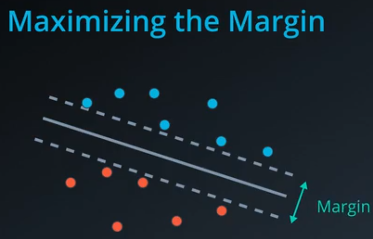
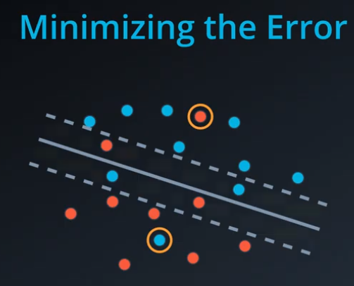
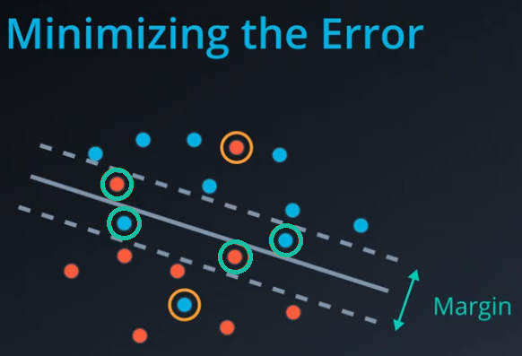
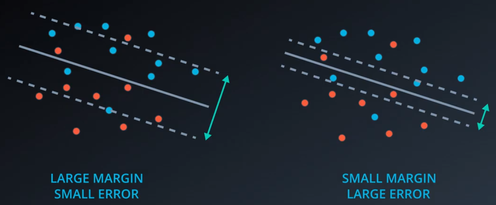
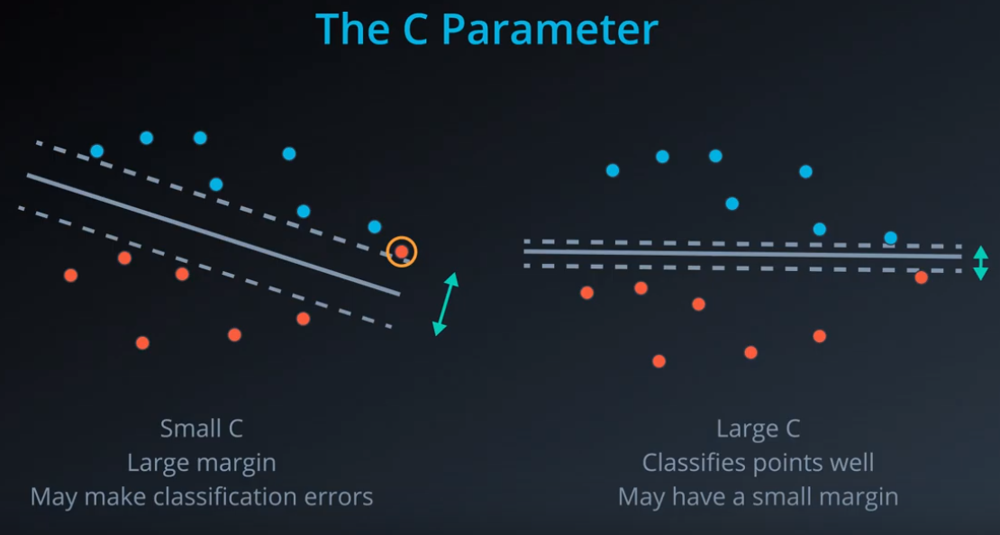

# ND025 - Supervised Learning - Lesson 05

#### Tags
* Author : AH Uyekita
* Title  :  _SVM_
* Date   : 30/03/2019
* Course : Data Scientist Nanodegree Program
    * COD    : ND025
    * **Instructor:** Luis Serrano

***

## Support Vector Machine

The main objective of Support Vector Machine is to drawn a line to divide the data into two (or more) parts. Even more, this line has a kind of boundaries, which is also known as margin, and it is also an objective of the algorithm to maximize it.



<center><em>Figure 1 - Maximizing the Margins.</em></center><br>

So the reason to use the margins is to separate the two classes as far as possible, or as wide as possible. Unfortunately, sometime there are some misclassified points, as you can see in Figure 2, these kind of error is called **classification error**.



<center><em>Figure 2 - Classification Error.</em></center><br>

Bear in mind, I have excluded the misclassified points between the margins, the so-called **margin error**, that you can see in Figure 3.



<center><em>Figure 3 - Margin Error.</em></center><br>

Thus, the $Error$ is composed by these two above described errors.

$$\text{Error} = \text{Classification Error} + \text{Margin Error} \tag{1}$$

The goal here is to maximize the margin, which we could translate as small error, whereas small margins represents the opposite, which is huge errors. Figure 4 shows it in a picture.



<center><em>Figure 4 - Margins and Errors.</em></center><br>

The lines (to divide and the margins) could be noted as the regular line equation (2).

$$W \cdot x + b = 1 \tag{2}$$

Where:

$$W = \begin{bmatrix} w_1 \\ w_2 \end{bmatrix}$$

So, the distance between margins lines is defined as:

$$\text{Margin} = \frac{2}{\mid W \mid} \tag{3}$$

Where:

$$\mid W \mid = \sqrt{w_1^2 + w_2^2}$$

For this reason, If you rise the $\mid W \mid$ the Margin became smaller.

Finally, let's define the $Error$ in Equation (4):

$$\text{Error} = \mid W \mid ^ 2 \tag{4}$$

### Parameters

The SVM has some parameters to be adjusted.

```
SVC(C=1.0, kernel=’rbf’, degree=3, gamma=’auto_deprecated’, coef0=0.0, shrinking=True, probability=False, tol=0.001, cache_size=200, class_weight=None, verbose=False, max_iter=-1, decision_function_shape=’ovr’, random_state=None)[source]
```

#### C

The C parameters aims to give wight to the error.

$$\text{Error} = C \cdot \text{Classification Error} + \text{Margin Error} $$

The effect of C is resume in Table 1.

|C|Margin|Points|
|:-:|:-:|:-:|
|Large|Small|Classifying Points Well|
|Small|Large|May make classification errors|

Figure 5 illustrate it.



<center><em>Figure 5 - Parameter C effects.</em></center><br>

#### Kernel

Let the SVM to split the data using not only a simple line, but you can also use circle, parabolas, elipsis, etc.. So, kernel could be: `linear`, `poly`, and `rbf`.

The **gamma** is an exclusive parameter of `rbf` kernel.
