# ND025 - Supervised Learning - Lesson 03

#### Tags
* Author : AH Uyekita
* Title  :  _Hierarchical and Density-based Clustering_
* Date   : 09/04/2019
* Course : Data Scientist Nanodegree Program
    * COD    : ND025-br
    * **Instructor:** Jay Alammar

***

## K-means Considerations

The K-means limitations rely on the cluster circle shape, due to the concept has based on the distance to Centroid. Figure 1 shows an example when K-means has a good results.

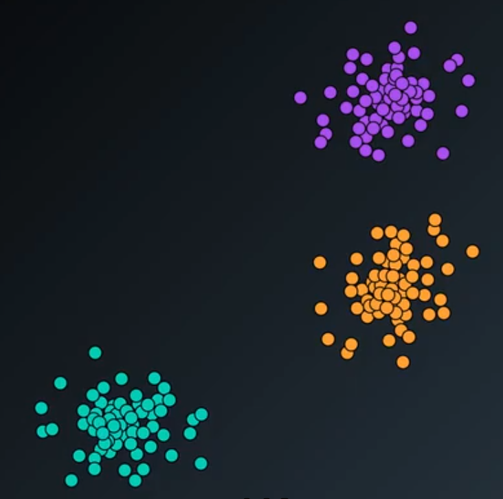

<em><center>Figure 1 - Example when K-means has good results.</center></em>

A similar problem is presented in Figure 2, but with a shape a bit streched. Clearly there are three cluster.

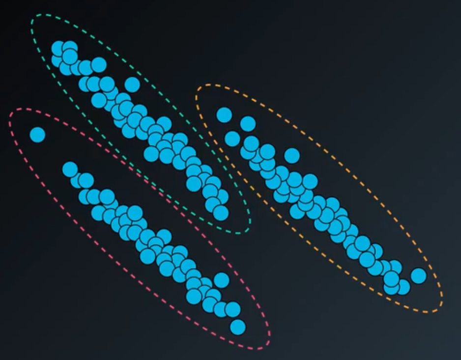

<em><center>Figure 2 - New dataset to be clustered.</center></em>

The results when apply it the K-means is presented in Figure 3. As you can see, the K-means did not divide the points as expected.

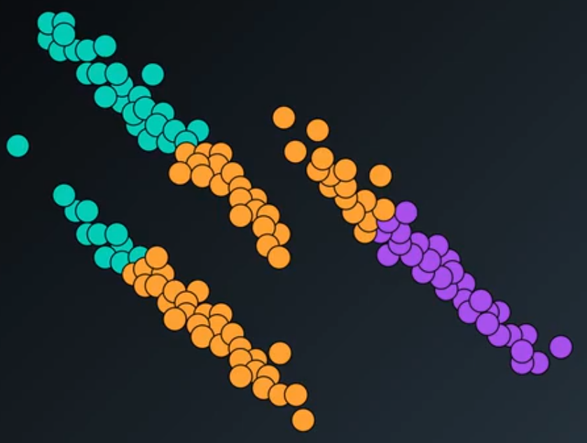

<em><center>Figure 3 - K-means results.</center></em>

This is the drawback of using K-means, generally the clusters should have circle or spherical shapes to be properly divided.

#### K-means Comparison

Figure 4 shows an ilustrations with several datasets.

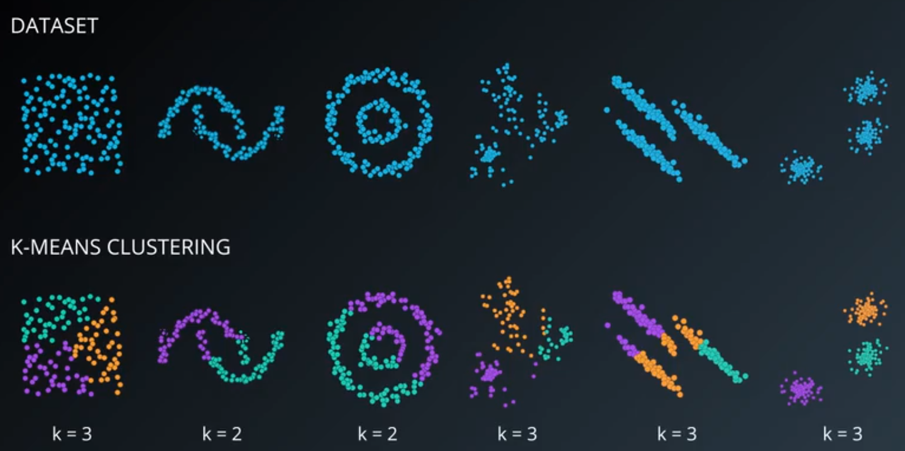

<em><center>Figure 4 - K-means outcome of several datasets.</center></em>

Founded on the problems presented to clusters different shapes of points, such as two crescent, two O rings, etc.. There are two other methods to cluster points as you can see in Figure 5.

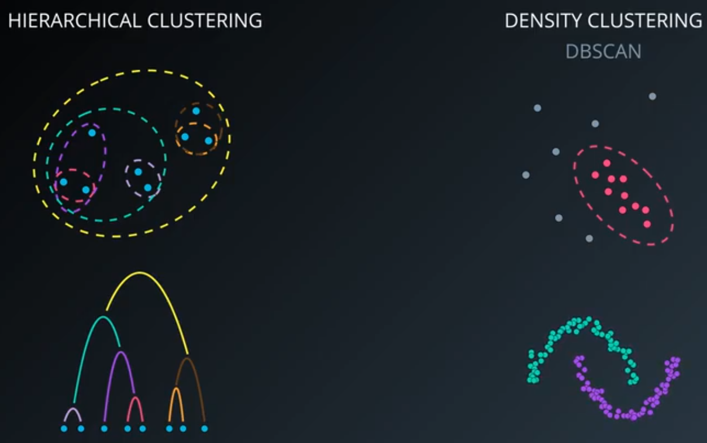

<em><center>Figure 5 - New techniques to cluster.</center></em>

## Hierarchical Clustering

This kind of cluster method has founded on the concept of each point is a cluster. For each step we should aggregate two points into one cluster. This is performed calculating the distance between clusters, the closest clusters should be merged into one.

Bear in mind, the way the distance is calculate determine the kind of the Hierarchical Clustering.

### Single-link Clustering

The Single-link Hierarchical Clustering aims to group the closest clusters into one. Figure 6 shows it.

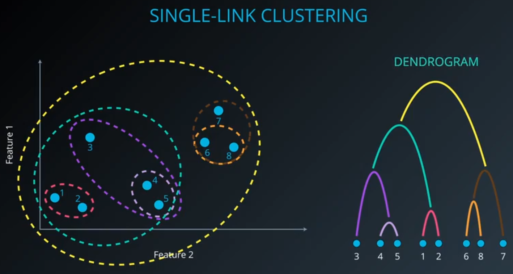

<em><center>Figure 6 - Single-link Clustering.</center></em>

As you can see, the Dendogram highest is the order to group the points. According to the "cut" of this dendogram you can determine the number of cluster you want.

#### Shortcoming

Due to the way used to group the points, this kind of Hierarchical clustering technique is prone to create clusters elongated as you can see in Figure 7.

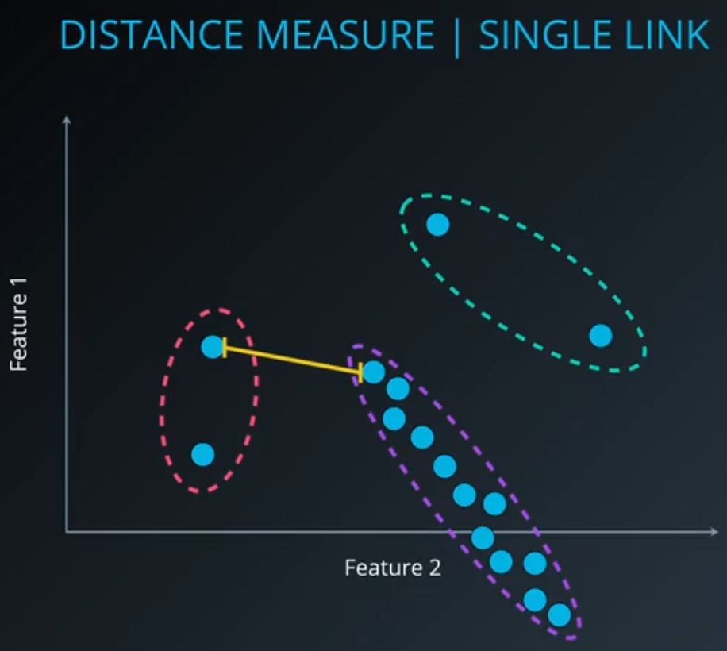

<em><center>Figure 7 - Shortcoming of Single-link Hierarchical Clustering.</center></em>

Even more, sometimes the Single-link clustering creates cluster that covers all the points.

#### K-means Comparison

Figure 8 shows a comparison between K-means and Single-link.

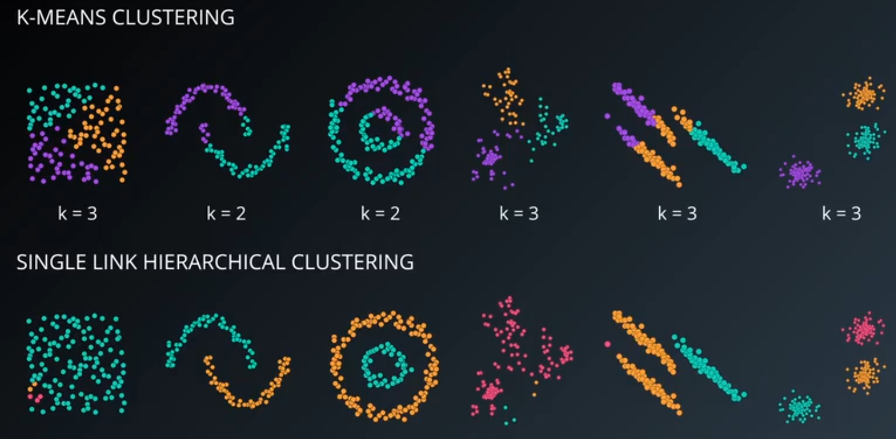

<em><center>Figure 8 - K-means and Single-link comparison.</center></em>

The second, third, and sixth are the ones with better results. The first and the fourth falls into the shortcoming of one cluster eats up almost all points.

However, this problem could be overcame analysing the dendogram, as you can see in Figure 9.

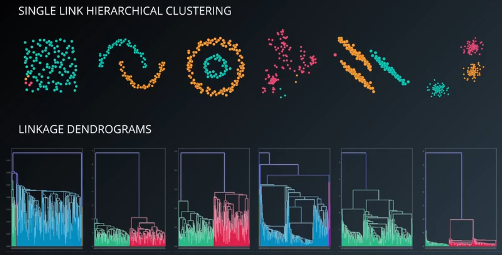

<em><center>Figure 9 - Linkage Dendogram.</center></em>

In some cases, it is possible to see the clusters presence that it not reflected in the final. This is the case of the fourth example, where there are three cluster according to the level of the cut. The same happens in the fifth case.

Lastly, the Single-link Hierarchical Clustering **is not** part of Scikit Learn package.

### Complete Link Clustering

The complete-link is similar to the single-link, the difference rely on the way to calculate the distance. In this case, we uses the farthest distance points to use as parameter of grouping.

#### Shortcoming

Unfortunately, this kind of Hierarchical Clustering method also has a shortcoming. This is presented in Figure 10, the problem is the same of presented in Single-link where only one point is taking account to calculate the distânce.

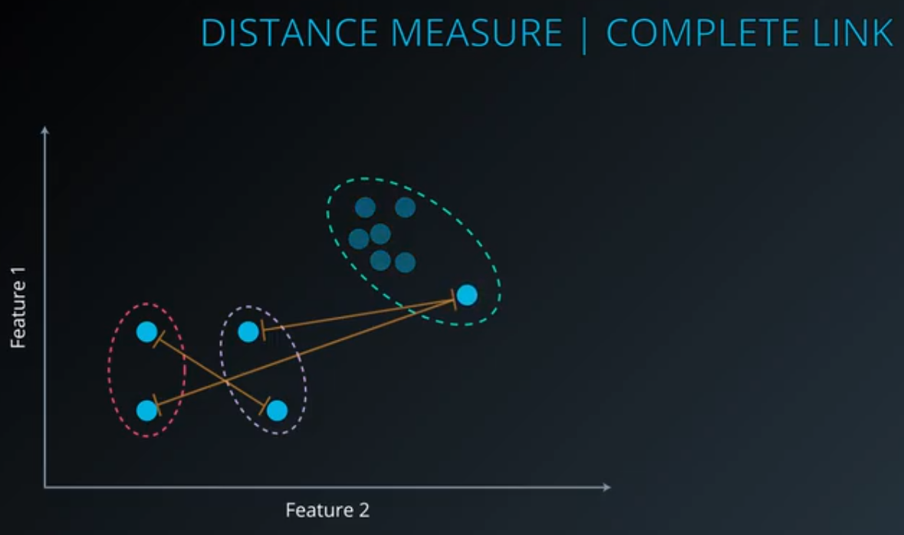

<em><center>Figure 10 - Complete-link Shortcoming.</center></em>

### Average Link Clustering

Instead of using the closest or the farthest points, this method summarize the distances using the average.


<em><center>Figure 11 - Average Link.</center></em>

### Ward's Method

This method uses the variance between two cluster to decide which one should be clustered. Figure 12 shows an example of how to perform the calculation of variance.

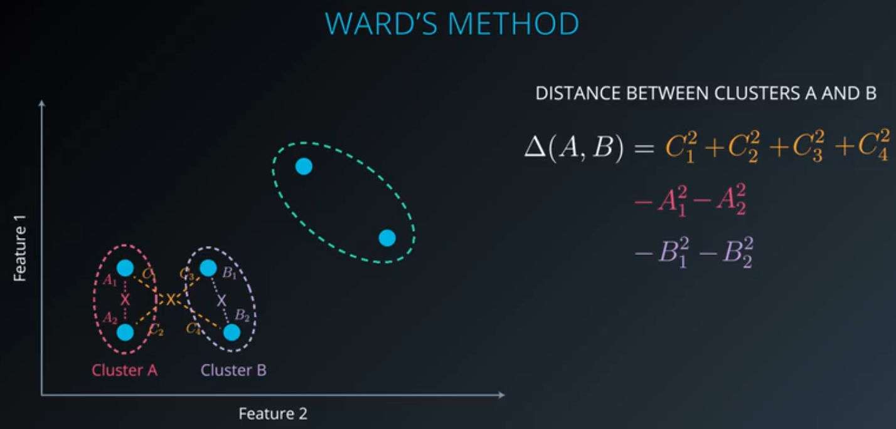

<em><center>Figure 12 - Ward's Method.</center></em>

The first step is to calculate the center point of the cluster and then calculate the distance of all point to this center. The variance of the square of the distance will be used to determine which cluster should be merged.

### Clustering using Scikit Learn

The Scikit Learn has these three linkage.

**Importing the Scikit Learn Module**
```py
# Importing the library
from sklearn import cluster
```

**Creating the object**
```py
# Using the constructor
clust = cluster.AgglomerativeClustering(n_cluster = 3,
                                        linkage = 'ward')
```

**Predicting**
```py
# Creating the labels to cluster the observations.
labels = clust.fit_predict(X)
```

You can visualize the Dendogram using the Scipy module.

**Importing Scipy module**
```py
# Importing the scipy module.
from scipy.cluster.hierarchy import dendogram, ward, single
```

**Creating object linkage_matrix**
```py
# Creating a object to be used by dendogram.
linkage_matrix = ward(X)
```
**Plot the Dendogram**
```py
# Plotting the dendogram.
dendogram(linkage_matrix)

plt.show()
```
### Advantages and Disadvantages

**Advantages:**
* Resulting hierarchical representation can be very informative;
* Provides and additional ability to visualize, and;
* Especially potent when the dataset contains real hierarchical relationships (e.g. Evolutionary Biology).

**Disadvantages:**
* Sensitive to noise and outliers, and;
* Computaionally intensive $O(N^2)$.

## DBSCAN (Density-based Spatial Clustering of Applications with Noise)

The DBSCAN is totally different from the other techniques already presented. Because it introduce the idea of noise, in this way I need to define two new inputs:

* `Epsilon`: This is the radius around the point to search any other point;
* `MinPts`: The minimum quantity of points required to form a density cluster.

Figure 13 shows an example of how to apply this method.

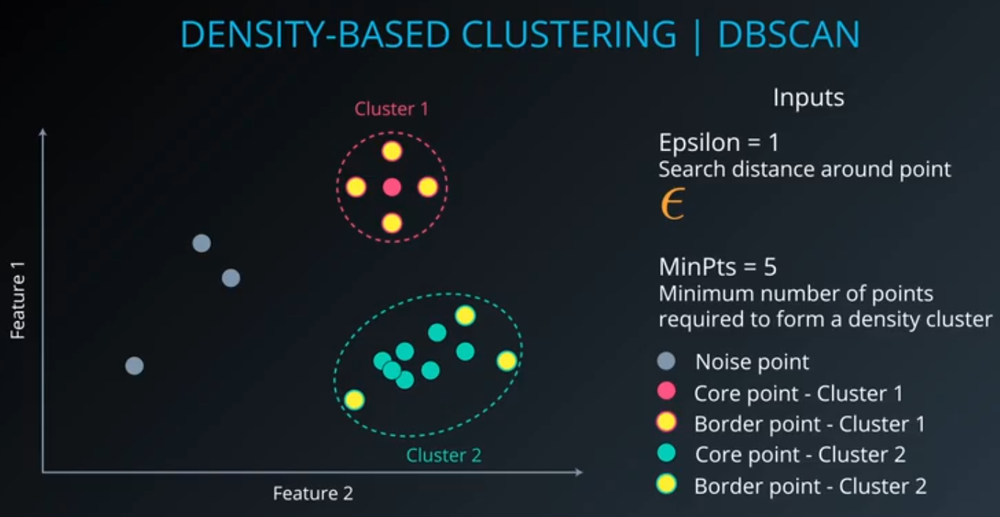

<em><center>Figure 13 - DBSCAN.</center></em>

#### K-means Comparison

Figure 14 shows a comparison between the K-means and DBSCAN outcomes.

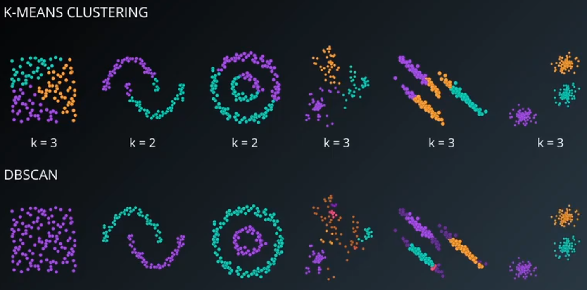

<em><center>Figure 14 - K-means and DBSCAN Comparison.</center></em>

#### Scikit Learn

It is very simple to use DBSCAN in Scikit Learn.
**Importing cluster module**
```py
# Importing the module.
from sklearn import cluster
```

**Constructor**
```py
# Creating the object DBSCAN
db = cluster.DBSCAN(eps = 0.5,           # Epsilon
                    min_samples = 5)     # MinPts
```

**Training**
```py
# Training the object.
db.fit(X)
```

**Printing the clusters**
```py
# Printing the labels.
print(db.labels_)
```
Have in mind, all observations with label equal to -1 means it is noise.

### Advantages and Disadvantages

**Advantages:**
* We do not need to specify the number of clusters;
* Flexibility in the shapes & sizes of clusters;
* Able to deal with noise, and;
* Able to deal with outliers.

**Disadvantages:**
* Border points that are rechable from two clusters, and;
* Faces difficulty finding clusters of varying the densities.
