# ND025 - Supervised Learning - Lesson 04

#### Tags
* Author : AH Uyekita
* Title  :  _Gaussian Mixture Models and Cluster Validation_
* Date   : 10/04/2019
* Course : Data Scientist Nanodegree Program
    * COD    : ND025-br
    * **Instructor:** Jay Alammar

***

## Gaussian Mixture Models Clustering

This is a soft clustering algorithm, which calculates for each point/observation the membership for every cluster. The highest membership will determine the cluster of that point. Figure 1 shows it.

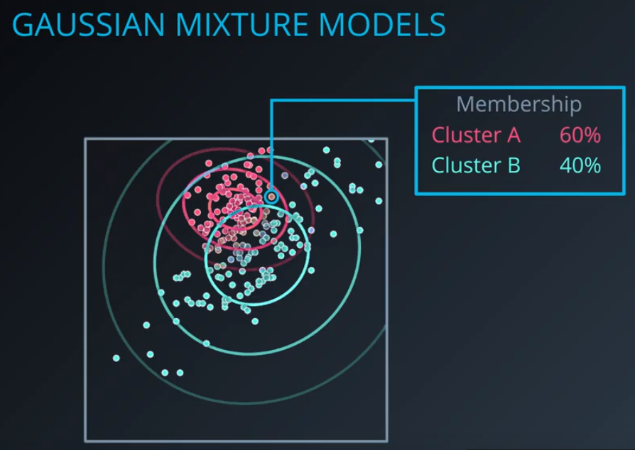

<em>
Figure 1 - GMM Example.
</em>

To facilitate the interpretation, let's visualize an 1D example. In Figure 2, you can see "two groups" of points.

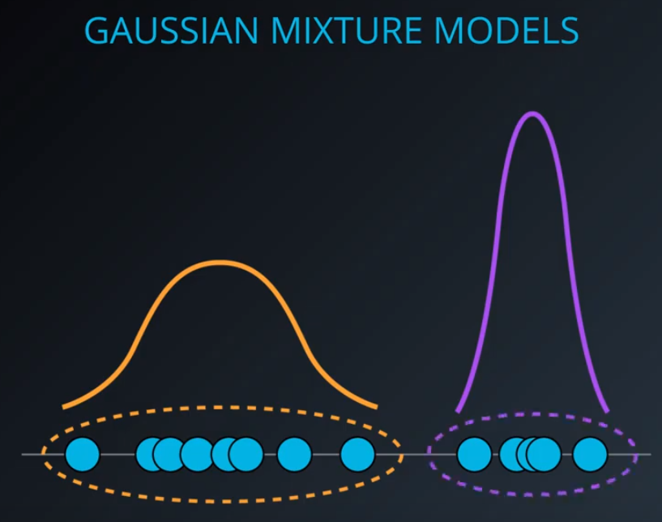

<em>
Figure 2 - 1D Example.
</em>

Each group could be modeled as an output of two different Gaussian Distribution. To turn it a bit more realistic, Figure 3 shows it in a 2D example.

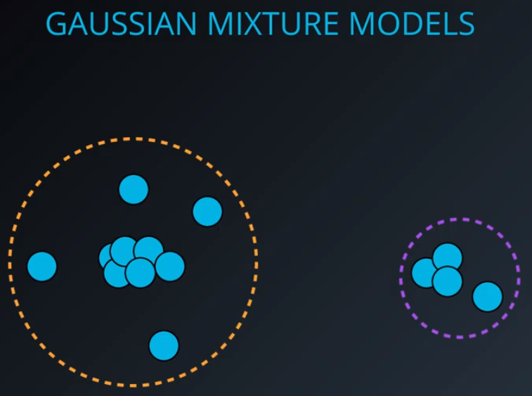

<em>
Figure 3 - 2D Example.
</em>

The GMM accomplish the clusterization based on the idea of each cluster has your own distribution, thus the GMM is based on the Gaussian Distribution. Figure 4 shows the Normal Distribution also known as Gaussin Distribution.

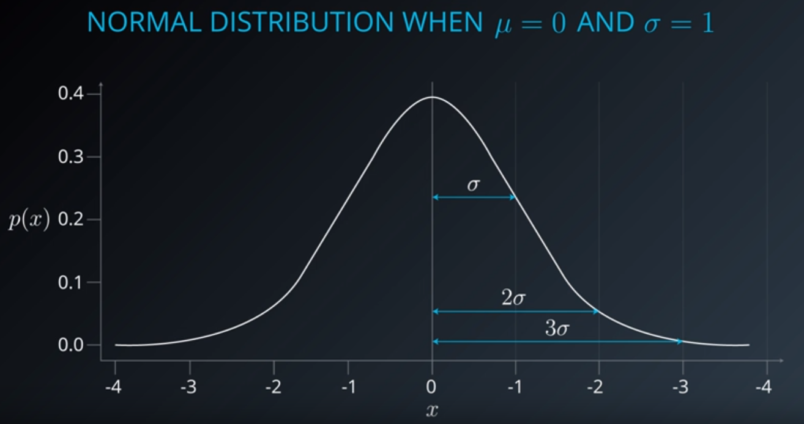

<em>
Figure 4 - Gaussian Distribution.
</em>

#### Gaussian Distribution Recap

Analysing one dimension feature, you can use the histogram to aid the visualization. As you can see in Figure 5.

<em>
Figure 5 - Bell Curve and Histogram of 1D Feature.
</em>

The bandwidth between the average (delimited by the standard deviations) represents 68% of the points in the dataset. This is a property of the Gaussian Distribution.

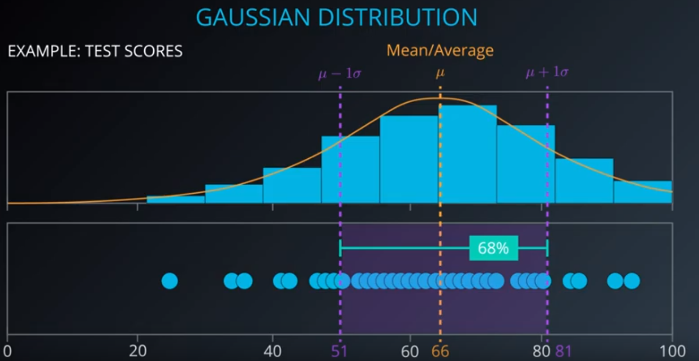

<em>
Figure 6 - Standard Deviation and Percentage of Points.
</em>

If you increase the bandwidth to 2 standard deviations around the average, the region will comprise 95%. Lastly, if you have chosen 3 three standard deviations the region reaches 99%.

Now, let's dive in using two dimensions represented in one dimension (like a projection).

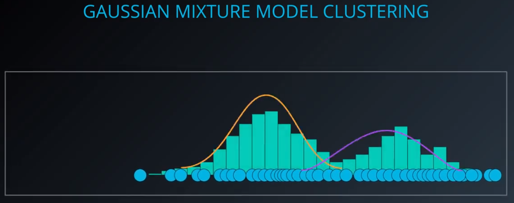

<em>
Figure 7 - Two Gaussians Distributions.
</em>

Adopting a 2D representation, you can plot the variables Chemistry Score and Geology Score on X and Y axis. This is the case of a Multivariate Gaussian Distribution.

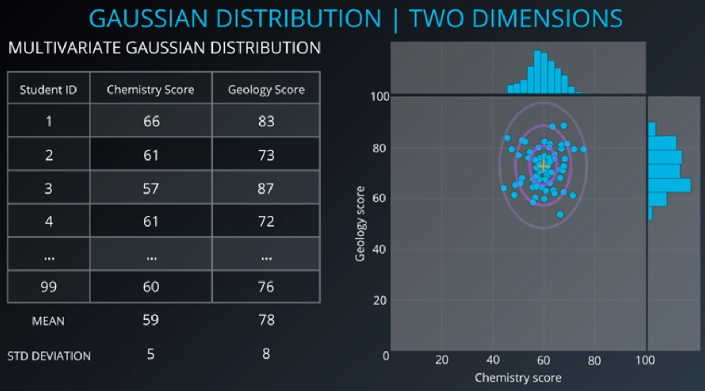

<em>
Figure 8 - Multivariate Gaussian Distribution.
</em>

### Expectation - Maximization for Gaussian Mixtures

The steps to perform the GMM Clustering.

* <kbd>STEP 1</kbd> - Initialize K Gaussian Distribuions;
* <kbd>STEP 2</kbd> - Soft-Cluster Data - **Expectation**;
* <kbd>STEP 3</kbd> - Re-estimate the Gaussians - **Maximization**;
* <kbd>STEP 4</kbd> - Evaluate Log-likelihood to check for convergence, and;
* Repeat from <kbd>STEP 2</kbd> until converged.

#### Example

##### Step 1

In this case we have used the random initialization. We assume some values to use as averages and standard deviations.

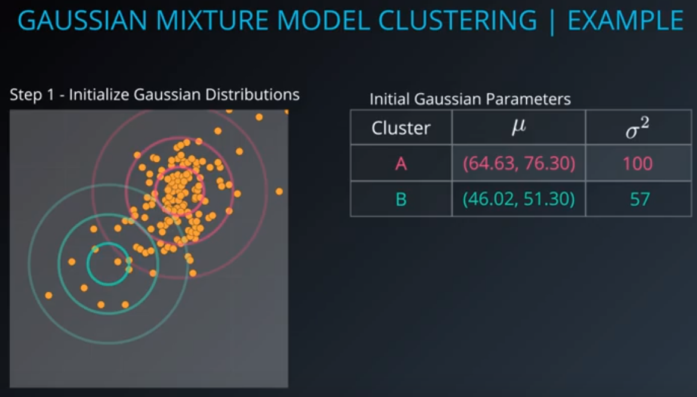

<em>
Figure 9 - Parameters Initialization.
</em>

For this example I have assumed:

|Cluster|Average feature 1|Average feature 2|Standard Deviation|
|:-:    |:-:              |:-:              |:-:               |
|A      |64.63            |76.30            |100               |
|B      |46.02            |51.30            |57                |

##### Step 2 - Expectation

In this Step we are going to calculate the cluster memberships values for each points. First, we need to calculate the likelihood using the Equation (1):

$$N(X|\mu,\sigma^2) = \frac{1}{2 \pi \sigma^2} e^{-\frac{1}{2 \pi \sigma} (X - \mu)^2 } \tag{1}$$

Thereafter, it is necessary to normalize the results using the Equation (2).

$$E[Z_{1A}] = \frac{N(X|\mu_A,\sigma^2_A)}{N(X|\mu_A,\sigma^2_A) + N(X|\mu_B,\sigma^2_B)} \tag{2}$$

Figure 10 shows an example of how to apply it.

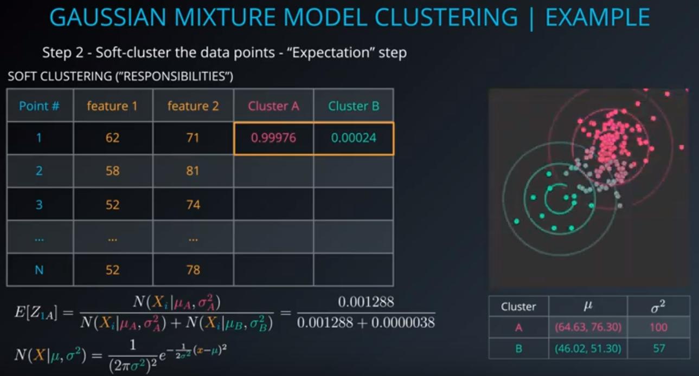

<em>
Figure 10 - Calculating the Maximum Expectation.
</em>

$$N(X_1 = 62|\mu_A = 64.63, \sigma^2 = 100) = \frac{1}{\sqrt{2 \pi 100^2}} e^{-\frac{1}{2 \pi 100} (62 - 64.63)^2} = 0.001336$$

$$N(X_1 = 71|\mu_B = 76.30, \sigma^2 = 57) = \frac{1}{\sqrt{2 \pi 57^2}} e^{-\frac{1}{2 \pi 57} (71 - 76.30)^2} = 0.00000987$$

##### Step 3

##### Step 4

## Cluster Validation

This is the procedure to evaluate Clustering results. There are three categories of Cluster Validation.

* **External Indices:** Based on the labels data and usually when performing a Supervised Learning;

* **Internal Indices:** Based on data internal scores when performing a Unsupervised Learning;

* **Relative Indices:** ????

Most of the indices is based on Compactness and Separability.

* **Compactness:** This is a measure of how close the points of a cluster are to each other;

* **Separability:** This is a measure of how far two cluster are to each other.

The basic concept behind it, is to create cluster with elements very close to each other and cluster are most distinct to each other.

#### External Indices

These scores are calculated when you have the labels of the dataset. Generally, in a Supervised Learning model.

Figure 11 shows some of the score available in Scikit Learn to evaluate using external indices.

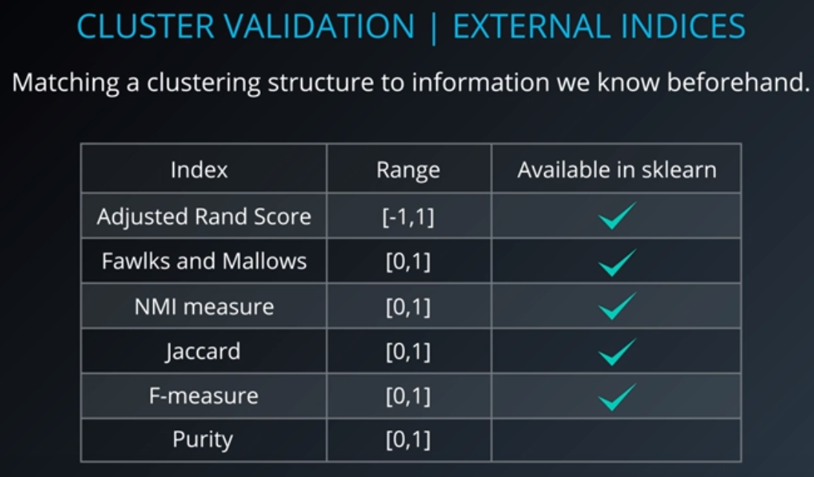

<em>
Figure 11 - External Indices.
</em>

Using the Adjusted Randon Index (ARI) as an example, Figure 12 shows the values of ARI.

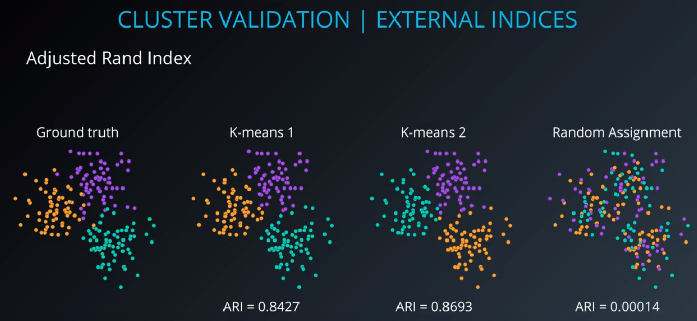

<em>
Figure 12 - External Indices Comparison.
</em>

#### Internal Indices

.
